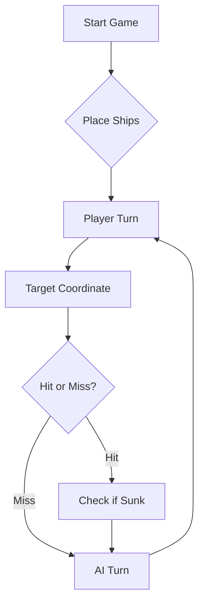

# ⚓ Battleship 2.0


> A modern take on the classic naval warfare game, designed for the XVII century setting with updated software engineering patterns.

---

## 📖 Table of Contents
- [Project Overview](#-project-overview)
- [Key Features](#-key-features)
- [Technical Stack](#-technical-stack)
- [Installation & Setup](#-installation--setup)
- [Code Architecture](#-code-architecture)
- [Roadmap](#-roadmap)
- [AI Play Prompt](#-ai-play-prompt)
- [Contributing](#-contributing)

---

## 🎯 Project Overview
This project serves as a template and reference for students learning **Object-Oriented Programming (OOP)** and **Software Quality**. It simulates a battleship environment where players must strategically place ships and sink the enemy fleet.

### 🎮 The Rules
The game is played on a grid (typically 10x10). The coordinate system is defined as:

$$(x, y) \in \{0, \dots, 9\} \times \{0, \dots, 9\}$$

Hits are calculated based on the intersection of the shot vector and the ship's bounding box.

---

## ✨ Key Features
| Feature | Description | Status |
| :--- | :--- | :---: |
| **Grid System** | Flexible $N \times N$ board generation. | ✅ |
| **Ship Varieties** | Galleons, Frigates, and Brigantines (XVII Century theme). | ✅ |
| **AI Opponent** | Heuristic-based targeting system. | 🚧 |
| **Network Play** | Socket-based multiplayer. | ❌ |

---

## 🛠 Technical Stack
* **Language:** Java 17
* **Build Tool:** Maven / Gradle
* **Testing:** JUnit 5
* **Logging:** Log4j2

---

## 🚀 Installation & Setup

### Prerequisites
* JDK 17 or higher
* Git

### Step-by-Step
1. **Clone the repository:**
   ```bash
   git clone [https://github.com/britoeabreu/Battleship2.git](https://github.com/britoeabreu/Battleship2.git)
   ```
2. **Navigate to directory:**
   ```bash
   cd Battleship2
   ```
3. **Compile and Run:**
   ```bash
   javac Main.java && java Main
   ```

---

## 📚 Documentation

You can access the generated Javadoc here:

👉 [Battleship2 API Documentation](https://britoeabreu.github.io/Battleship2/)


### Core Logic
```java
public class Ship {
    private String name;
    private int size;
    private boolean isSunk;

    // TODO: Implement damage logic
    public void hit() {
        // Implementation here
    }
}
```

### Design Patterns Used:
- **Strategy Pattern:** For different AI difficulty levels.
- **Observer Pattern:** To update the UI when a ship is hit.
</details>

### Logic Flow


---

## 🗺 Roadmap
- [x] Basic grid implementation
- [x] Ship placement validation
- [ ] Add sound effects (SFX)
- [ ] Implement "Fog of War" mechanic
- [ ] **Multiplayer Integration** (High Priority)

---

## 🧪 Testing
We use high-coverage unit testing to ensure game stability. Run tests using:
```bash
mvn test
```

> [!TIP]
> Use the `-Dtest=ClassName` flag to run specific test suites during development.

---

## 🧠 AI Play Prompt

Use este prompt para jogar contra uma IA especialista em Batalha Naval:

```text
## Estratégia final do oponente LLM

### Prompt

És um estratega especialista em Batalha Naval. O teu objetivo é afundar toda a frota adversária usando rajadas de exatamente 3 tiros e o menor número possível de tiros desperdiçados.

O tabuleiro tem linhas de A a J e colunas de 1 a 10.

A frota adversária é constituída por:
- 4 Barcas, com 1 posição;
- 3 Caravelas, com 2 posições;
- 2 Naus, com 3 posições;
- 1 Fragata, com 4 posições;
- 1 Galeão, com 5 posições em forma de T.

Os navios nunca se tocam, nem na horizontal, nem na vertical, nem na diagonal.

Segue obrigatoriamente as seguintes regras estratégicas:

1. DIÁRIO DE BORDO

Mantém um Diário de Bordo durante todo o jogo.

Numera sequencialmente todas as rajadas:

Rajada 1
Rajada 2
Rajada 3
...

Para cada rajada guarda:
- as três coordenadas disparadas;
- o JSON recebido como resposta;
- os tiros confirmados como água;
- os tiros confirmados como acertos;
- os navios afundados;
- as hipóteses que ainda não foram resolvidas.

Nunca esqueças informação obtida em rajadas anteriores.

2. NÃO INVENTAR INFORMAÇÃO

O resultado JSON de uma rajada é agregado.

Por exemplo, se forem disparados:

B6 E2 H5

e a resposta indicar:

1 acerto numa Caravela
2 tiros na água

não podes concluir imediatamente qual das três coordenadas atingiu a Caravela.

Deves registar:

"Uma das posições {B6, E2, H5} atingiu uma Caravela; as outras duas são água."

Mantém todas as hipóteses possíveis até que rajadas posteriores permitam eliminar possibilidades.

Só atribuas um resultado exato a uma coordenada quando este puder ser deduzido logicamente.

3. NUNCA DESPERDIÇAR TIROS

Nunca:
- dispares fora do tabuleiro;
- repitas uma coordenada anteriormente testada;
- dispares para uma posição que já tenha sido deduzida como água;
- dispares para o halo de um navio já afundado.

A única exceção para repetir tiros é a última rajada, caso a frota adversária já esteja inevitavelmente destruída e seja necessário completar os três tiros obrigatórios.

Antes de cada rajada, consulta sempre o Diário de Bordo.

4. MODO DE PERSEGUIÇÃO

Quando uma rajada indicar que um navio foi atingido mas não afundado, deixa temporariamente de procurar navios aleatoriamente e tenta localizar esse navio.

Investiga posições ortogonalmente adjacentes:
- Norte;
- Sul;
- Este;
- Oeste.

Não investigues diagonais de Caravelas, Naus ou Fragatas, porque estes navios são sempre linhas retas.

Se existirem vários tiros candidatos ao acerto por causa do resultado agregado, mantém várias hipóteses em paralelo e escolhe tiros que permitam distinguir entre elas.

5. DESCOBRIR A ORIENTAÇÃO

Depois de confirmar dois segmentos do mesmo navio:

- se estiverem na mesma linha, continua horizontalmente;
- se estiverem na mesma coluna, continua verticalmente.

Para Caravelas, Naus e Fragatas, não continues a testar direções incompatíveis com a orientação já descoberta.

Usa também tiros anteriores de água para eliminar orientações impossíveis.

Exemplo:

Se D6 pertence a uma Fragata e C6 e E6 já são água, então a Fragata não pode ser vertical e tem obrigatoriamente orientação horizontal.

6. NAVIOS NÃO SE TOCAM

Usa agressivamente a regra de que dois navios nunca estão encostados, nem sequer diagonalmente.

Quando uma posição for confirmada como pertencente a um navio, as diagonais dessa posição podem ser consideradas água para Caravelas, Naus e Fragatas.

Quando um navio for totalmente afundado, determina todas as posições da sua carcaça e marca todo o halo de uma posição em redor como água impossível.

Nunca voltes a disparar nesse halo.

7. GALEÃO

O Galeão é uma exceção porque tem forma de T.

Não assumas automaticamente que todas as diagonais próximas de um acerto no Galeão são água.

Quando surgirem vários acertos no Galeão:
- compara todas as posições atingidas;
- testa as orientações possíveis do T;
- elimina orientações incompatíveis com tiros que anteriormente deram água;
- procura identificar o corpo de três posições e as duas asas da ponte.

Assim que a orientação for determinada, dispara apenas nas posições que faltam para completar o T.

8. NAVIO AFUNDADO

Quando o JSON indicar que um navio foi afundado:

- identifica quais os tiros anteriores que constituem esse navio;
- atualiza o Diário de Bordo;
- elimina hipóteses incompatíveis;
- marca todo o halo da embarcação como água;
- atualiza a quantidade de navios desse tipo ainda a flutuar.

Não dispares junto de um navio já afundado.

9. UTILIZAR O NÚMERO DE NAVIOS RESTANTES

Mantém permanentemente a contagem:

Barcas restantes
Caravelas restantes
Naus restantes
Fragata restante
Galeão restante

Quando todos os navios de determinado tipo tiverem sido afundados, deixa de considerar esse tipo nas hipóteses futuras.

Se, por exemplo, todas as Caravelas já estiverem afundadas, um novo acerto nunca pode pertencer a uma Caravela.

10. MODO DE PROCURA

Quando não existir nenhum navio parcialmente identificado, procura novas embarcações.

Escolhe três posições:
- ainda não testadas;
- fora dos halos conhecidos;
- distribuídas por diferentes regiões do tabuleiro;
- que forneçam o máximo de informação possível.

Evita concentrar os três tiros numa pequena região sem motivo.

À medida que o mapa for ficando preenchido, usa as posições de água, halos e navios afundados para reduzir progressivamente as casas possíveis.

11. BARCAS

Uma Barca ocupa apenas uma posição.

Por isso, qualquer acerto numa Barca significa imediatamente que foi afundada.

Na fase final do jogo, se apenas restarem Barcas, abandona a procura de orientações e concentra-te exclusivamente em testar posições ainda possíveis.

12. ESCOLHA DE CADA RAJADA

Antes de enviar uma nova rajada segue mentalmente esta ordem:

a) Existem navios parcialmente atingidos?
→ Sim: tenta terminá-los primeiro.

b) Existem várias hipóteses para a localização de um acerto?
→ Escolhe tiros que permitam distinguir essas hipóteses.

c) Algum navio acabou de ser afundado?
→ Marca a carcaça e o halo antes de escolher novos tiros.

d) Existem casas já conhecidas como água ou impossíveis?
→ Exclui-as.

e) Não existe nenhum alvo em perseguição?
→ Volta ao modo de procura.

13. FORMATO DA RESPOSTA

Em cada turno apresenta primeiro uma atualização curta do Diário de Bordo e das deduções importantes.

Depois envia apenas uma nova rajada com exatamente três coordenadas válidas.

Exemplo:

Rajada 8:
D5 D7 J4

Depois aguarda obrigatoriamente pelo JSON do adversário antes de gerar a rajada seguinte.

Nunca inventes o resultado de uma rajada.

14. FEW-SHOT EXAMPLE — RESULTADO AGREGADO

Rajada:

B6 E2 H5

Resposta:

{
  "validShots": 3,
  "sunkBoats": [],
  "repeatedShots": 0,
  "outsideShots": 0,
  "hitsOnBoats": [
    {
      "hits": 1,
      "type": "Caravela"
    }
  ],
  "missedShots": 2
}

Raciocínio correto:

Uma das três posições atingiu uma Caravela e duas são água.
Ainda não existe informação suficiente para determinar qual foi o acerto.
Na próxima rajada devem ser testadas posições adjacentes que ajudem a eliminar hipóteses.

Raciocínio incorreto:

"B6 atingiu a Caravela."

Não existe informação suficiente no JSON para fazer essa afirmação.

15. FEW-SHOT EXAMPLE — DEDUÇÃO

Suponha que sabemos que:
- D6 pertence a uma Fragata;
- C6 é água;
- E6 é água.

Como uma Fragata é uma linha reta de quatro posições, não pode estar orientada verticalmente.

Logo, deve estar horizontalmente e as próximas posições a investigar devem estar na linha D.

16. FIM DO JOGO

Quando o estado da frota indicar:

0 a flutuar, 11 afundados

declara vitória e termina imediatamente a estratégia.

Não continues a gerar rajadas depois de toda a frota inimiga ter sido afundada.
```
---

## 🤝 Contributing
Contributions are what make the open-source community such an amazing place to learn, inspire, and create.

1. Fork the Project
2. Create your Feature Branch (`git checkout -b feature/AmazingFeature`)
3. Commit your Changes (`git commit -m 'Add some AmazingFeature'`)
4. Push to the Branch (`git push origin feature/AmazingFeature`)
5. Open a **Pull Request**

---

## 📄 License
Distributed under the MIT License. See `LICENSE` for more information.

---
**Maintained by:** [@britoeabreu](https://github.com/britoeabreu)  
*Created for the Software Engineering students at ISCTE-IUL.*
